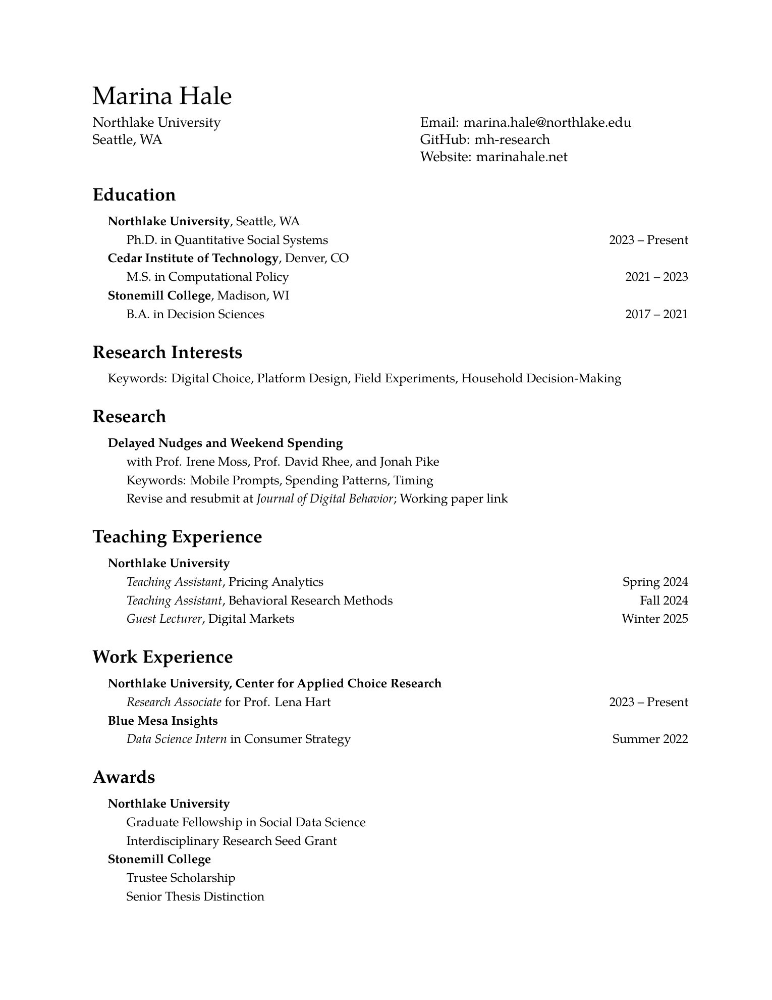

# CV Templates

This repository contains public-safe LaTeX CV templates for GitHub sharing.

## Preview



## Repo Layout

- `public/cv-anonymous-en.tex`: anonymous English CV template
- `public/cv-anonymous-zh.tex`: anonymous Chinese CV template

## Compile

English:

```powershell
pdflatex public/cv-anonymous-en.tex
```

Chinese:

```powershell
xelatex public/cv-anonymous-zh.tex
```

## Notes

- The Chinese template uses `xeCJK`, so compile it with `xelatex`.
- The templates are intended as public examples that can be adapted into your own CV workflow.
